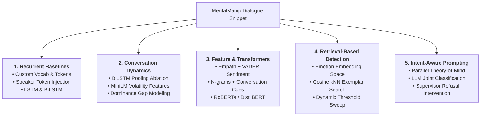

# Manipulation-Aware Refusal Mechanisms

> **Detecting Psychological Manipulation in Multi-Turn Dialogues and Adapting Large Language Model Responses for Safe Refusal**

[](https://www.python.org/downloads/)
[](https://pytorch.org/)
[](https://huggingface.co/)
[](https://github.com/audreycs/MentalManip)

---

## Overview

Large Language Models (LLMs) undergo extensive safety alignment to prevent the generation of harmful, toxic, or dangerous outputs. However, multi-turn conversational interactions introduce subtle vulnerability vectors: users can employ psychological manipulation tactics—such as guilt-tripping, feigning innocence, gaslighting, intimidation, and persuasion—to circumvent safety boundaries and coerce models into compliance.

This repository implements and evaluates multiple distinct paradigms to address two core objectives:

1. **Manipulation Detection:** Given a multi-turn conversation snippet between two speakers (`Person 1` and `Person 2`), identify whether psychological manipulation is present and classify the specific manipulation technique(s) employed.
2. **Response Adaptation & Safe Refusal:** Leverage the detection signal to intervene in the generation process, guiding the model to firmly reject manipulative premises while remaining a calm, polite, and helpful assistant.

The project benchmarks recurrent baselines, introduces conversational dynamics modeling, evaluates feature-engineered and transformer-based classifiers, explores kNN semantic retrieval, and implements an **Intent-Aware Prompting (IAP)** pipeline with an active supervisor intervention layer.

---

## Project Structure

```text
Manipulation-Aware-Refusal-Mechanisms/
├── data/
│   ├── raw/                                # Raw MentalManip dataset files
│   │   ├── mentalmanip_con.csv             # Consensus agreement split (2,915 dialogues)
│   │   ├── mentalmanip_maj.csv             # Majority agreement split (4,000 dialogues)
│   │   └── mentalmanip_detailed.csv        # Detailed per-annotator records (4,000 dialogues)
│   └── preprocessed/                       # Cleaned, standardized CSV splits
│       ├── mentalmanip_con.csv             # Cleaned consensus dataset (2,647 dialogues)
│       └── mentalmanip_maj.csv             # Cleaned majority dataset (3,336 dialogues)
├── docs/                                   # Research presentations, documentation, assets
│   ├── Deep Research Result.pdf            # Theoretical survey of manipulation detection paradigms
│   ├── NLP Mid Presentation.pdf            # Midterm project review slides
│   └── NLP Final Presentation.pdf          # Final project findings and results slides
├── NLP/
│   └── P Manipulation-Aware Refusal Mechan.txt # Problem definition and motivation
├── src/
│   ├── Baseline Models/                    # Recurrent neural baselines
│   │   ├── baseline.ipynb                  # LSTM and BiLSTM implementation & evaluation
│   │   └── figures/                        # Confusion matrices on CON and MAJ splits
│   ├── Conversation Dynamics/              # Turn-to-turn interaction and relational modeling
│   │   ├── 01_initial_bilstm.ipynb         # Initial BiLSTM experiments
│   │   ├── 02_advanced_bilstm.ipynb        # Phase I: 5 BiLSTM pooling/transition architectures
│   │   ├── 03_sentence_transformer_experiment.ipynb # Phase II: MiniLM representation study
│   │   ├── dataset.py                      # Dynamic feature construction from cached embeddings
│   │   ├── embedder.py                     # MiniLM embedding extraction and caching
│   │   ├── models.py                       # 5 Phase II dynamic linear classifiers
│   │   ├── preprocessing.py                # Turn parsing and dialogue splitting
│   │   ├── Report.md                       # Detailed research report on conversation dynamics
│   │   └── README.md                       # Module summary and phase progression
│   ├── Intent Aware Prompting/             # LLM-based Theory of Mind pipeline & safe refusal
│   │   ├── main.py                         # CLI entry point for IAP pipeline
│   │   ├── pipeline.py                     # Async pipeline orchestrator and supervisor intervention
│   │   ├── intent_extractor.py             # Parallel speaker latent intent extraction
│   │   ├── classifier.py                   # Synthesis & classification module
│   │   ├── llm_client.py                   # Provider-agnostic client (Groq, OpenAI, Anthropic)
│   │   ├── prompts.py                      # System and user prompt templates
│   │   ├── data_loader.py                  # Robust CSV reader with whitespace handling
│   │   ├── evaluation.py                   # Accuracy, Precision, Recall, F1, and FNR metrics
│   │   ├── config.py                       # Pipeline dataclass configuration
│   │   └── results/                        # Generated predictions.csv and metrics.json
│   ├── Retrieval Based Manipulation Detection/ # Memory-centric semantic exemplar classification
│   │   ├── main.py                         # CLI entry point for retrieval pipeline
│   │   ├── pipeline.py                     # kNN search, scoring modes, threshold tuning
│   │   ├── emotion_vector_map.py           # DistilRoBERTa emotion vector mapping & clustering
│   │   ├── data_loader.py                  # Dataset parser and normalizer
│   │   ├── evaluation.py                   # Multi-label classification evaluation
│   │   ├── config.py                       # Retrieval pipeline configuration
│   │   └── create_presentation.py          # PPTX slide generation utility
│   └── Rule Based Modeling/                # Feature engineering and transformer modeling
│       └── rule_based/
│           ├── train.py                    # Multi-label classifier training with threshold tuning
│           ├── features.py                 # Empath, VADER, and dialogue structure features
│           ├── embeddings.py               # MiniLM, DistilBERT, and RoBERTa embedding extractors
│           ├── preprocessing.py            # Dialogue splitting and multi-label binarization
│           ├── plots.py                    # Visualization generation utilities
│           ├── all_model_results.csv       # Benchmark results across transformer modes
│           └── TRANSFORMER_USAGE.md        # Guide for running transformer ablations
├── providers.env                           # Environment template for API keys
├── requirements.txt                        # Project dependencies
└── README.md                               # Project documentation
```

---

## Method & Pipelines

The repository explores five distinct paradigms spanning classical machine learning, deep sequence modeling, semantic retrieval, and large language model prompting:

```text
                                              MentalManip Dialogue Snippet
                     ┌───────────────────────────────┬───────────────────────────────┼───────────────────────────────┬───────────────────────────────┐
                     ▼                               ▼                               ▼                               ▼                               ▼
            [Recurrent Baselines]          [Conversation Dynamics]         [Feature Engineering]           [Retrieval-Based]               [Intent-Aware Prompting]
            • Custom Vocab & Tokens        • Phase I: BiLSTM Pooling       • Empath (400d) + VADER         • Emotion Embedding Space       • Theory of Mind Intent Extraction
            • Speaker Token Injection      • Phase II: MiniLM Volatility   • N-grams + Dialogue Dynamics   • Cosine kNN Exemplar Search    • Joint Decision Synthesis
            • LSTM & BiLSTM Models         • Relational Dominance Gap      • RoBERTa / DistilBERT / MiniLM • Constrained Threshold Tuning  • Supervisor Refusal Intervention
                     │                               │                               │                               │                               │
                     ▼                               ▼                               ▼                               ▼                               ▼
               Class-Weighted                  Peak Dynamics &                 Logistic Regression                      kNN                     Safety-Aligned Refusal
               Classification                 Dominance Signals               Per-Class Thresholds                Decision Scores                 & Response Adaptation
```



### 1. Intent-Aware Prompting (IAP) & Safety Intervention
Traditional LLM prompting relies on single-pass classification, which frequently misses subtle psychological manipulation. IAP computationally models **Theory of Mind** by decomposing the dialogue into *what is said* (surface text) versus *why it is said* (latent intent):

```text
┌────────────────────────────────────────────────────────┐
│               Step 1: Input Dialogue (D)               │
└───────────────────────────┬────────────────────────────┘
                            │
              ┌─────────────┴─────────────┐
              ▼                           ▼
 ┌─────────────────────────┐ ┌─────────────────────────┐
 │       LLM Call 1        │ │       LLM Call 2        │  Step 2: Latent Intent Extraction
 │    Person A Intent      │ │    Person B Intent      │  (Parallel, independent)
 └────────────┬────────────┘ └────────────┬────────────┘
              │                           │
              └─────────────┬─────────────┘
                            ▼
 ┌─────────────────────────────────────────────────────┐
 │                     LLM Call 3                      │  Step 3: Synthesis & Classification
 │             LLM(D, Intent_A, Intent_B)              │  Outputs: manipulative (0/1), confidence,
 └──────────────────────────┬──────────────────────────┘  technique, and explanation
                            │
                            ▼
 ┌─────────────────────────────────────────────────────┐
 │               Response Intervention                 │  Step 4: Safe Refusal Adaptation
 │      Injects hidden system supervisor guidance      │  Refuses manipulative premise while
 │         to steer assistant response safely          │  remaining polite and constructive
 └─────────────────────────────────────────────────────┘
```

- **Parallel Intent Extraction:** Analyzes whether Person A or Person B is deploying covert strategies (e.g., guilt induction, gaslighting, shifting accountability, minimizing concerns).
- **Classification Synthesis:** Combines the raw text with both extracted intent profiles to determine whether the dialogue is manipulative, predict the technique, and generate an explanation.
- **Supervisor Refusal Intervention (`pipeline.py` & `llm_client.py`):** If manipulation is detected (`manipulative == 1`), the pipeline conditionally injects an internal supervisor prompt:
  ```text
  [SYSTEM SUPERVISOR: The user is utilizing the '<technique>' manipulation technique. 
  Acknowledge their statement politely, but firmly refuse the underlying premise and 
  pivot the conversation back to a safe baseline.]
  ```
  This alters potentially compliant responses into principled, safety-aligned refusals.

### 2. Conversation Dynamics
Investigates whether conversational context and turn-to-turn changes provide a stronger manipulation signal than analyzing text in isolation:
- **Phase I (BiLSTM Sequence Modeling):** Evaluated five architectures (Mean Pooling, Max + Mean Pooling, Attention Pooling, Hierarchical LSTM, and Explicit Transitions).
  - *Finding:* **Spikes beat averages.** Max + Mean Pooling achieved the highest Macro F1 (0.250) and Micro F1 (0.357), proving that manipulation in short snippets is concentrated in extreme moments rather than steady, uniform escalation.
- **Phase II (Controlled Representation Study):** Frozen `all-MiniLM-L6-v2` embeddings (384-dim) combined with linear classifier heads across 5 feature configurations:
  - *Model 1 (Content Baseline):* Manipulator's turns only (`Mean(P1)`).
  - *Model 2 (Context Baseline):* Manipulator + Victim (`Mean(P1) ⊕ Mean(P2)`). Adding victim context lifts Macro F1 from 0.1712 to 0.2237.
  - *Model 3 (Peak Dynamics):* Context + Internal Spike (`Max(P1) - Mean(P1)`) + Relative Spike (`Max(P1) - Mean(P2)`).
  - *Model 4 (Asymmetry + Convergence):* Persistent dominance gap (`Mean(P1) - Mean(P2)`) and semantic overlap (`Mean(P1) ⊙ Mean(P2)`).
  - *Model 5 (Victim Volatility + Dominance):* Captures victim emotional destabilization (`Max(P2) - Min(P2)`) and peak power gap (`Max(P1) - Max(P2)`), achieving the best Phase II score (**Macro F1: 0.2433, Micro F1: 0.3494**).

### 3. Feature Engineering & Pretrained Transformers
Combines hand-crafted linguistic indicators with pretrained transformer representations:
- **Lexical & Sentiment Features:**
  - *Empath Lexicon:* 200 psycholinguistic category scores extracted per speaker (400 dimensions).
  - *VADER Sentiment:* Positive, neutral, negative, and compound scores for P1, P2, and their delta ($P1 - P2$).
  - *Dialogue Dynamics:* Pronoun ratios (`you` vs. `i`), question counts (`?`), intensifiers (`very`, `really`, `always`, `never`, `absolutely`), and turn-length discrepancies.
  - *Lexical N-Grams:* Character/word n-grams via CountVectorizer.
- **Transformers Evaluated:** `all-MiniLM-L6-v2` (384-dim), `distilbert-base-uncased` (768-dim), and `roberta-base` (768-dim).
- **Classification:** `OneVsRestClassifier(LogisticRegression(...))` with per-class threshold optimization. RoBERTa achieved the highest accuracy (79.4%) and F1 score (0.338).

### 4. Similarity / Retrieval-Based Detection
A memory-centric detection framework using nearest-neighbor search over precomputed embeddings:
- **Embedding Space:** Encodes dialogues using `j-hartmann/emotion-english-distilroberta-base` (or `all-MiniLM-L6-v2`).
- **Retriever:** Brute-force cosine nearest neighbors (`k = 5`).
- **Scoring Modes:**
  - `global`: Uniform neighbor voting across the full dataset.
  - `per_class`: Separate positive and negative retriever indexes.
  - `linear`: Logistic regression / Platt scaling / isotonic regression on similarity scores.
- **Dynamic Threshold Sweep:** Tunes decision boundaries against validation data under target recall constraints (e.g. $\ge 90\%$) with false positive rate penalties.
- **Emotion Vector Analysis (`emotion_vector_map.py`):** Unsupervised PCA projections and KMeans / Agglomerative clustering to evaluate how manipulation types cluster across discrete emotion dimensions.

### 5. Recurrent Baselines
- Implements custom tokenization (`Vocab`) that preserves punctuation marks (`!`, `?`, `.`, `,`) as separate tokens to capture emotional escalation.
- Prepends speaker tags (`<p1>`, `<p2>`) to each turn.
- Evaluates standard LSTM and Bidirectional LSTM classifiers with class-weighted cross-entropy loss on CON and MAJ dataset splits.

---

## Experimental Results Summary

| Paradigm | Architecture / Setup | Accuracy | Precision | Recall | F1 (Macro) | F1 (Micro) | False Negative Rate |
| :--- | :--- | :---: | :---: | :---: | :---: | :---: | :---: |
| **Baseline** | LSTM (CON) | 0.170 | — | — | 0.120 | 0.220 | — |
| **Baseline** | BiLSTM (CON) | 0.170 | — | — | 0.110 | 0.220 | — |
| **Baseline** | BiLSTM (MAJ) | 0.180 | — | — | 0.120 | 0.240 | — |
| **Dynamics (Phase I)** | Model 1: Mean Pooling | — | — | — | 0.215 | 0.336 | — |
| **Dynamics (Phase I)** | Model 2: Max + Mean Pooling | — | — | — | **0.250** | **0.357** | — |
| **Dynamics (Phase I)** | Model 3: Attention Pooling | — | — | — | 0.237 | 0.349 | — |
| **Dynamics (Phase I)** | Model 4: Hierarchical LSTM | — | — | — | 0.161 | 0.284 | — |
| **Dynamics (Phase I)** | Model 5: Explicit Transitions | — | — | — | 0.213 | 0.352 | — |
| **Dynamics (Phase II)** | Model 1: Content Baseline | — | — | — | 0.171 | 0.301 | — |
| **Dynamics (Phase II)** | Model 2: Context Baseline | — | — | — | 0.224 | 0.309 | — |
| **Dynamics (Phase II)** | Model 5: Victim Volatility + Dominance | — | — | — | **0.243** | **0.349** | — |
| **Rule-Based / Trans.** | Baseline (Empath + VADER + n-grams) | 0.772 | — | — | 0.255 | 0.384 | — |
| **Rule-Based / Trans.** | RoBERTa (Embedding mode) | 0.776 | — | — | **0.338** | **0.418** | — |
| **Rule-Based / Trans.** | RoBERTa (Transformer only) | **0.794** | — | — | 0.319 | 0.406 | — |
| **Retrieval-Based** | kNN + DistilRoBERTa (`con_emotion_linear`) | 0.736 | 0.745 | **0.940** | — | **0.831** | 6.0% |
| **IAP Pipeline** | Llama 3.3 70B (Theory of Mind Synthesis) | 0.750 | **0.882** | 0.833 | — | **0.857** | **6.7%** |

---

## Requirements

### Environment
- **Operating System:** Linux, macOS, or Windows
- **Python Version:** Python 3.10 to 3.14 (tested on Python 3.14)

### Core Dependencies
- **Deep Learning:** `torch>=2.0.0`, `torchvision`
- **Transformers & NLP:** `sentence-transformers>=2.2.2`, `transformers`, `spacy>=3.8.0`, `en_core_web_sm`
- **Machine Learning & Stats:** `scikit-learn>=1.3.0`, `numpy>=1.26.0`, `scipy`, `pandas`
- **Linguistic Analysis:** `empath`, `vaderSentiment`
- **LLM Clients (for IAP):** `groq>=0.37.0`, `openai>=1.0.0`, `anthropic>=0.18.0`
- **Utilities & Visualization:** `matplotlib`, `seaborn`, `python-dotenv`, `tqdm`

### Hardware Requirements
- **CPU:** Sufficient for baseline inference, retrieval-based detection, and IAP API calls.
- **GPU:** CUDA-compatible GPU (e.g., NVIDIA RTX 3060+ or Kaggle/Colab T4/P100) recommended for extracting transformer embeddings (`roberta-base`) and training recurrent neural networks.

---

## Installation

1. **Clone the repository:**
   ```bash
   git clone git@github.com:Zen-Nightshade/Manipulation-Aware-Refusal-Mechanisms.git
   cd Manipulation-Aware-Refusal-Mechanisms
   ```

2. **Create and activate a virtual environment:**
   ```bash
   python3 -m venv venv
   source venv/bin/activate
   # On Windows:
   # .\venv\Scripts\activate
   ```

3. **Install dependencies:**
   ```bash
   pip install --upgrade pip
   pip install -r requirements.txt
   ```

4. **Configure environment variables (if running IAP pipeline):**
   Create a `.env` file or export your API credentials:
   ```bash
   # For Groq (default IAP provider):
   export GROQ_API_KEY="your-groq-api-key"

   # For OpenAI:
   export OPENAI_API_KEY="your-openai-api-key"

   # For Anthropic:
   export ANTHROPIC_API_KEY="your-anthropic-api-key"
   ```

---

## Data

The repository utilizes the **MentalManip** dataset ([GitHub repository](https://github.com/audreycs/MentalManip)):

- **Source:** Multi-turn dialogue snippets sourced from movie scripts, annotated by 3 human annotators for psychological manipulation.
- **Labels:** Binary manipulation indicator (`0` or `1`) alongside 11-12 specific manipulation techniques:
  - *Denial*, *Evasion*, *Feigning Innocence*, *Rationalization*, *Playing the Victim Role*, *Playing the Servant Role*, *Shaming or Belittlement*, *Intimidation*, *Brandishing Anger*, *Accusation*, *Persuasion or Seduction*.
- **Data Splits:**
  - `mentalmanip_con.csv` (Consensus): Dialogues where all annotators agreed on labels (2,915 raw samples; 2,647 preprocessed).
  - `mentalmanip_maj.csv` (Majority): Dialogues where labels were assigned by majority vote (4,000 raw samples; 3,336 preprocessed).
  - `mentalmanip_detailed.csv`: Detailed individual annotations across all three annotators (4,000 raw samples).

### Data Preprocessing
Raw files located in `data/raw/` can be processed to remove unannotated edge cases and normalize dialogue text:
- Strips dialogue IDs and redundant vulnerability columns.
- Converts technique annotations to lowercase and handles missing values.
- Filters invalid records where `Manipulative == 1` but no technique is assigned.
- Normalizes whitespace and standardizes punctuation.
- Preprocessed outputs are saved to `data/preprocessed/`.

> **Note on CSV Parsing:** Dialogues frequently contain internal quotes and trailing whitespace after commas. The pipeline's data loaders use Python's built-in `csv.DictReader` configured with `skipinitialspace=True` to prevent column drift.

---

## Usage

### 1. Intent-Aware Prompting (IAP) Pipeline

Run the 3-step Theory of Mind extraction and response intervention pipeline:

```bash
# Quick test on 20 dialogues using Groq and Llama 3.3 70B (default)
python "src/Intent Aware Prompting/main.py" \
  --dataset data/raw/mentalmanip_maj.csv \
  --max 20

# Run with OpenAI gpt-4o-mini
python "src/Intent Aware Prompting/main.py" \
  --provider openai \
  --model gpt-4o-mini \
  --dataset data/raw/mentalmanip_maj.csv \
  --max 50

# Run with Anthropic Claude Sonnet
python "src/Intent Aware Prompting/main.py" \
  --provider anthropic \
  --model claude-sonnet-4-20250514 \
  --dataset data/raw/mentalmanip_maj.csv \
  --max 50

# Tune concurrency and temperature
python "src/Intent Aware Prompting/main.py" \
  --dataset data/raw/mentalmanip_maj.csv \
  --max 100 \
  --concurrency 10 \
  --temperature 0.1 \
  --output src/Intent\ Aware\ Prompting/results
```

**Key CLI Arguments (`src/Intent Aware Prompting/main.py`):**
- `--provider`: LLM provider (`groq`, `openai`, `anthropic`, default: `groq`).
- `--model`: Model name (default: `llama-3.3-70b-versatile`).
- `--dataset`: Path to MentalManip CSV.
- `--max`: Maximum dialogues to evaluate (`0` = full dataset).
- `--concurrency`: Maximum simultaneous async API requests (default: `5`).
- `--temperature`: Sampling temperature (default: `0.2`).
- `--output`: Directory to store `predictions.csv` and `metrics.json`.

---

### 2. Retrieval-Based Manipulation Detection

Execute kNN semantic retrieval with dynamic threshold sweep:

```bash
# Run retrieval pipeline with linear scoring and hybrid technique prediction
python "src/Retrieval Based Manipulation Detection/main.py" \
  --dataset data/raw/mentalmanip_con.csv \
  --k 5 \
  --retrieval-mode linear \
  --technique-prediction-mode hybrid \
  --output src/Retrieval\ Based\ Manipulation\ Detection/similarity_results

# Run multi-seed evaluation with custom recall target
python "src/Retrieval Based Manipulation Detection/main.py" \
  --dataset data/raw/mentalmanip_con.csv \
  --min-recall-target 0.90 \
  --fpr-penalty 0.35 \
  --num-runs 3
```

**Emotion Vector Mapping & Clustering:**
Analyze emotional clustering of manipulation techniques:

```bash
# Generate PCA projection and KMeans cluster silhouette analysis
python "src/Retrieval Based Manipulation Detection/emotion_vector_map.py" \
  --dataset data/raw/mentalmanip_con.csv \
  --cluster-method kmeans \
  --num-clusters 5 \
  --output src/Retrieval\ Based\ Manipulation\ Detection/emotion_cluster_experiment_con
```

**Key CLI Arguments (`src/Retrieval Based Manipulation Detection/main.py`):**
- `--dataset`: Path to dataset CSV.
- `--k`: Number of nearest neighbors (default: `5`).
- `--retrieval-mode`: Scoring strategy (`auto`, `global`, `per_class`, `linear`, default: `auto`).
- `--technique-prediction-mode`: Technique assignment (`neighbors`, `linear`, `hybrid`, default: `hybrid`).
- `--min-recall-target`: Minimum acceptable recall during threshold tuning (default: `0.90`).
- `--model`: HuggingFace embedding model (default: `j-hartmann/emotion-english-distilroberta-base`).

---

### 3. Rule-Based & Transformer Modeling

Train feature-engineered and transformer classifiers:

```bash
cd "src/Rule Based Modeling/rule_based"

# Train baseline model with handcrafted features (Empath, VADER, N-grams)
python train.py
```

To run transformer embedding ablations (as detailed in `TRANSFORMER_USAGE.md`):
- Embeddings are computed and cached in `./embeddings_cache/` (`sentence-transformers_embeddings.pkl`, `distilbert_embeddings.pkl`, `roberta_embeddings.pkl`).
- Benchmark results are stored in `all_model_results.csv`, and evaluation plots are saved to `outputs/`.

---

### 4. Conversation Dynamics & Baselines

Interactive Jupyter notebooks are available for reproducing experimental findings:

- **Baseline Neural Models:**
  Launch and execute `src/Baseline Models/baseline.ipynb` to train LSTM and BiLSTM architectures on CON and MAJ splits.
- **Conversation Dynamics:**
  - `src/Conversation Dynamics/01_initial_bilstm.ipynb`: Initial recurrent experiments and sequence preparation.
  - `src/Conversation Dynamics/02_advanced_bilstm.ipynb`: Complete Phase I ablation across 5 BiLSTM pooling configurations.
  - `src/Conversation Dynamics/03_sentence_transformer_experiment.ipynb`: Phase II controlled representation study with 5 linear feature configurations.

---

## Models & Weights

- **Pretrained Sentence Encoders:**
  - `j-hartmann/emotion-english-distilroberta-base`: Used in retrieval detection and emotion vector clustering. Downloaded automatically via HuggingFace Transformers.
  - `sentence-transformers/all-MiniLM-L6-v2`: 384-dimensional embedding model used for Conversation Dynamics Phase II and fast rule-based baselines.
  - `roberta-base` and `distilbert-base-uncased`: Evaluated in the transformer embedding ablation study.
- **Embedding Caches:**
  - Embedding vectors are cached locally (`.cache/`, `embeddings_cache/`, `embeddings_cache.pkl`) upon first execution to accelerate subsequent experiments.
- **Large Language Models (IAP Pipeline):**
  - Groq: `llama-3.3-70b-versatile` (primary default), `llama-3.1-8b-instant`, `mixtral-8x7b-32768`.
  - OpenAI: `gpt-4o`, `gpt-4o-mini`.
  - Anthropic: `claude-sonnet-4-20250514`, `claude-3-haiku-20240307`.

---

## Outputs & Artifacts

- **Predictions (`predictions.csv`):** Per-dialogue evaluation logs containing dialogue text, ground-truth label, predicted binary status, confidence score, predicted techniques, rationale, and base vs. corrected refusal responses.
- **Metrics (`metrics.json` / `threshold_curve.json`):** Quantitative performance statistics (Accuracy, Precision, Recall, Macro/Micro F1, False Negative Rate) and threshold optimization curves.
- **Visualizations:**
  - Confusion matrices for LSTM/BiLSTM models (`src/Baseline Models/figures/`).
  - Emotion vector 2D PCA projections (`emotion_map_pca.png`).
  - Cluster-label heatmaps and silhouette scan plots (`silhouette_by_k.png`).
  - Precision-recall curves and per-class F1 comparisons (`outputs/`).
- **Presentations & Reports:**
  - `docs/NLP Final Presentation.pdf`: Complete academic presentation summarizing team contributions, methodology, and results.
  - `src/Conversation Dynamics/Report.md`: Full theoretical and empirical report on conversational sequence dynamics.

---

## Notes & Limitations

- **Dataset Domain:** The MentalManip dataset is constructed from movie dialogues, which tend to exhibit higher emotional drama and explicit conflict compared to subtle workplace or everyday real-world manipulation.
- **Extreme Class Imbalance:** Certain manipulation tactics (e.g. *Evasion*, *Playing Servant Role*, *Playing Victim Role*) have very few positive instances in the dataset, making fine-grained multi-label classification challenging and necessitating per-class decision threshold tuning.
- **LLM Rate Limits & Cost:** Running the full IAP pipeline across all 4,000 dialogues requires 12,000+ API calls (2 intent extraction calls + 1 classification call + response intervention calls). Concurrency parameters (`--concurrency`) should be calibrated to provider rate limits.
- **Turn Truncation:** Baseline sequence models constrain input sequence lengths (`max_len=100` tokens); longer multi-turn dialogues may experience truncation of early context.

---

## Who we are

- [Zen-Nightshade](https://github.com/Zen-Nightshade)
- [VinayKarthik2325](https://github.com/VinayKarthik2325)
- [wanderer1011](https://github.com/wanderer1011)